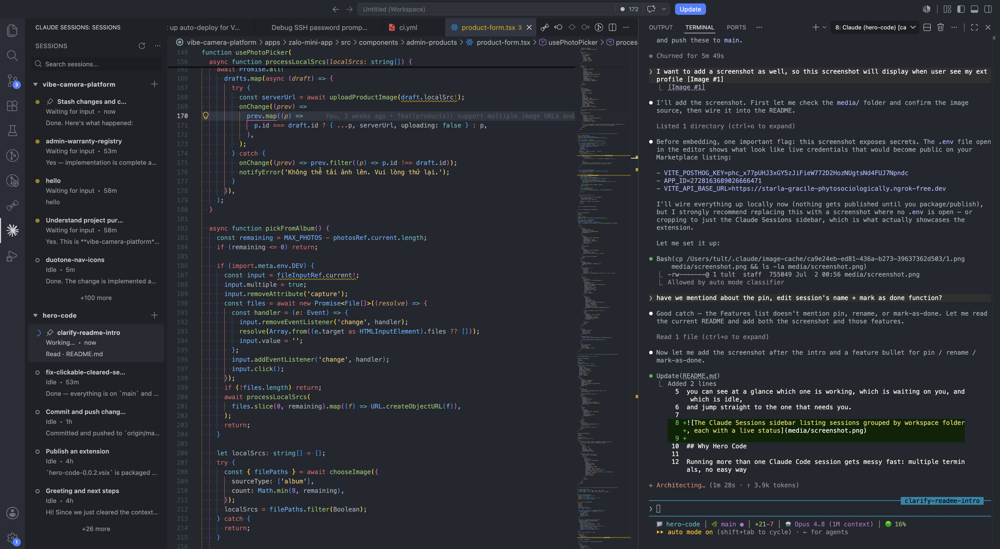

# Hero Code

A better way to run and manage multiple Claude Code sessions at once. Hero Code adds a
**Claude Sessions** sidebar to VS Code that lists every session with its live status — so
you can see at a glance which one is working, which is waiting on you, and which is idle,
and jump straight to the one that needs you.



## Why Hero Code

Running more than one Claude Code session gets messy fast: multiple terminals, no easy way
to tell what each is doing, and constant tab-switching. Hero Code turns them into a single,
always-current dashboard.

## Features

- **All your sessions in one sidebar** — every Claude Code session across your open
  workspace folders in one list, instead of hunting through terminal tabs.
- **Realtime status** — each session shows whether it's **Working**, **Waiting for input**,
  **Idle**, or **Error**, refreshed automatically so you always know where things stand.
- **New session in one click** — press the **add new (+)** button to start a fresh session;
  open or resume any existing session's terminal from its row.
- **Keep your sessions organized** — **pin** the ones you care about to the top, **rename**
  a session to something memorable, and **mark it done** when you're finished with it.
- **Send a selection to the session you choose** — mention an editor selection directly in
  the right session's terminal (not just whichever terminal happens to be focused).
  - With a selection: mentions the specific line range (`@path#L10-20`).
  - With no selection: mentions the whole file (`@path`).
  - Default keybinding: `ctrl+alt+k` (`alt+cmd+k` on macOS), while an editor has focus.

## Requirements

- VS Code `1.90.0` or later.
- [Claude Code](https://claude.com/claude-code) running in a terminal, with an active
  session selected in the Claude Sessions sidebar.

## Getting started

1. Install the extension.
2. Open the **Claude Sessions** view from the activity bar and select a session.
3. Select some code (or place your cursor in a file), then press `alt+cmd+k` /
   `ctrl+alt+k` to mention it in that session's terminal.

## Development

```bash
npm install        # install dependencies
npm run compile    # bundle src/extension.ts → dist/extension.js
```

Then press **F5** in VS Code to launch an Extension Development Host with the extension
loaded.

### Scripts

| Script                | Description                                    |
| --------------------- | ---------------------------------------------- |
| `npm run compile`     | Bundle the extension with esbuild.             |
| `npm run watch`       | Rebuild on change (used by the F5 build task). |
| `npm run package`     | Production (minified) bundle.                  |
| `npm run check-types` | Type-check with `tsc --noEmit`.                |
| `npm run lint`        | Lint `src` with ESLint.                        |

### Packaging

```bash
npx vsce package     # produces hero-code-0.0.1.vsix
```

## Release Notes

See [CHANGELOG.md](CHANGELOG.md).
